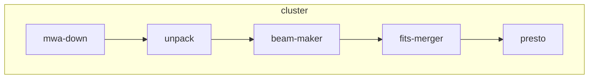
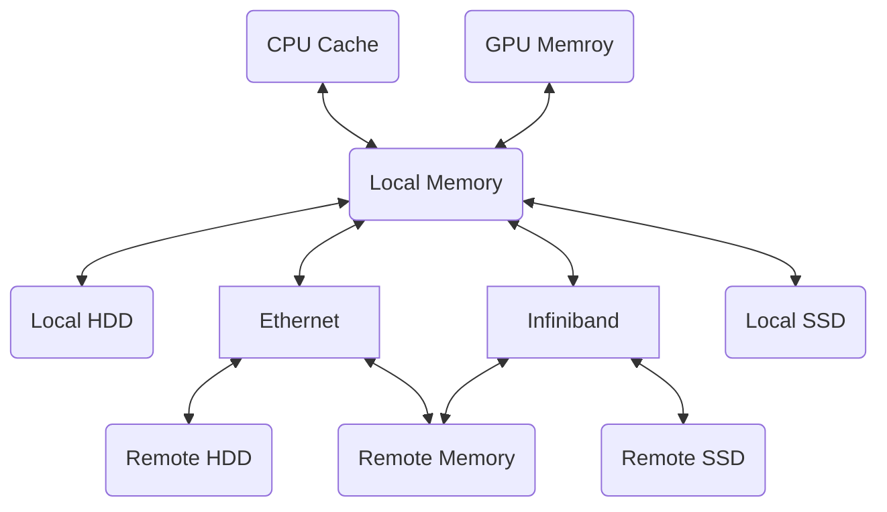
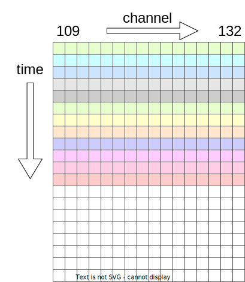
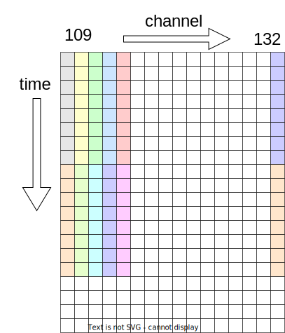
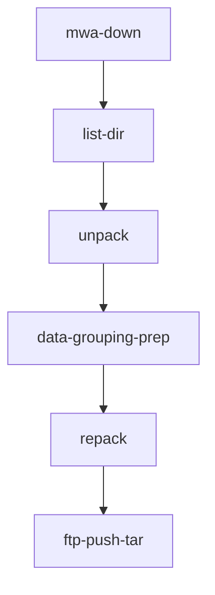
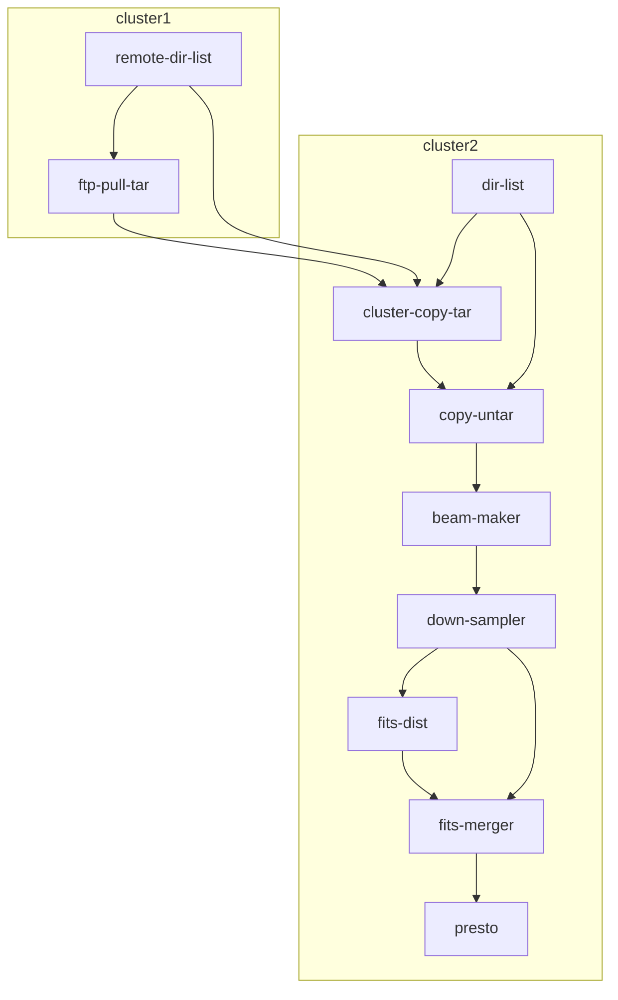

# MWA数据处理流水线

## 一、MWA流水线介绍

MWA流水线的模块结构示意图如下：

- mwa-down：实现mwa数据的广域网下载；
- unpack：将原始产品数据的tar文件解包为单秒dat文件；
- beam-make：按beam、指向，生成fits文件；
- fits-merger：按指向，将同指向的24个beam fits文件合并；
- presto：用presto软件对前述24beam的fits文件做脉冲搜索
- 
## 二、MWA流水线的相关数据量统计

### 2.1 原始产品数据(DIR_DAT)
- 按时间戳（秒）打包的24通道数据（后缀名为tar），解包后文件后缀为.dat
- 按观测集的数据量统计
  - 单个观测的时间长度：4800秒
  - 通道数：24个，109~132
  - 每个文件：327680000字节，313MiB
  - 文件总数：4800*24=115,200 个
  - 总数据量：3.775*10^13 B = 3.6*10^7 MiB ≈ 34.33 TiB
- 按12960指向计，数据处理中需读取总量为：12960 * 34.33TiB ≈ 434.5 PiB

### 2.2 定标数据(DIR_CAL)
- 按每个观测集来组织，还包含运行相关元数据等
- 每个观测集的数据量
  - 约72MiB

### 2.3 单指向、单通道的fits文件(DIR_1CH)
- 合并时间序列的原始数据dat文件，通过make-beam生成的单通道数据的fits文件
- 按观测集的单指向数据
  - 单指向、单通道30秒fits文件大小：38479680 B ≈ 36.70 MiB (1.223 MiB/秒)
  - 单指向单通道fits文件数量：24*4800/30=3840个
  - 总数据量：36.70 MiB * 3840 ≈ 137.61 GiB，约为原始数据的0.39%
- 按12960指向计，则总数据量为：12960 * 137.61 GiB ≈ 1.70 PiB

### 2.4 单指向、单通道的下采样后fits文件(DIR_1CHX)
- 针对DIR_1CH数据，在时间维上以1:4下采样，并以zstd压缩
- 按观测集的单指向数据
  - 单指向、单通道30秒fits文件大小：7.53 MiB (0.251 MB/秒)
  - 单指向单通道fits文件数量：24*4800/30=3840个
  - 总数据量：7.53 MiB * 3840 ≈ 28.24 GiB，约为原始数据的0.08%
- 按12960指向计，则总数据量为：12960 * 28.24 GiB ≈ 357.41 TiB

### 2.5 单指向24通道fits文件(DIR_24CH)
- 将单指向、单通道的fits文件合并为24通道的数据，并用zstd压缩
- 按观测集的单指向数据
  - 单指向24通道30秒fits文件大小：181.18 MiB
  - 单指向24通道fits文件数量：4800/30=160个
  - 总数据量：181.18 MiB * 160 ≈ 28.31 GiB
- 按12960指向计，则总数据量为：12960 * 28.31 GiB ≈ 358.29 TiB
  
### 2.5 presto搜索文件

#### ？

#### ？

### 2.6 总结
MWA数据处理过程中，读取的数据量达原始数据的万倍以上，达到百PiB规模，其I/O优化是数据处理流水线设计的关键。

- 波束合成数据量统计表

|  | 单通道单秒 | 单指向 | 全指向 |
|-----------|--------|--------|----------|
| DIR_DAT   | 313 MiB  | 34.33 TiB   | 434.5PiB |
| DIR_1CH   | 1.223 MiB | 137.61 GiB | 1.70 PiB |
| DIR_1CHX  | 0.251 MiB | 28.24 GiB  | 357.41 TiB |
| DIR_24CH  |           | 28.31 GiB  | 358.29 TiB |

## 三、原型测试

### 3.1 测试环境
- DCU计算节点
  - 4 DCU/节点
  - 128GB内存
  - 120GB本地可用的SSD

- 本地SSD加载原始观测产品数据、定标数据，并写入到本地SSD

### make-beam的初步测试结果
- 单次处理指向数：从计算过程与计算节点数量一致的角度看，可以取24的倍数（24、48、72、...）；如果节点数为24的约数（12、8、6、4、3、2、1），可以取与节点数相同。
- 数据处理长度：2分钟到5分钟（上限还需考虑计算过程的GPU资源消耗、本地SSD容量、内存容量后，再确认）
- 12960指向的单个观测数据集，处理时间预计为1600 DCU时

针对同一组原始数据，可以按24个指向为1组，对12960指向循环处理。

关于参数选择的实验，参见：[beam-maker](dockerfiles/beam-maker/test/README.md)

## 四、MWA流水线设计

### 4.1 设计思考
- MWA流水线

其主要模块的输入、输出数据量如下表：

|  模块名 | 输入数据量  | 输出数据量 |
|  ----  | ----  | ---- |
| unpack     | 34.3TiB | 34.3TiB |
| beam-maker | 434.5 PiB | 1.70 PiB |
| fits-merger | 358.3 TiB | 358.3 TiB | 

可以看出，beam-maker模块的读写数据规模极大，优化该模块是首要问题。

- 存储部件示意图

- 附表 数据访问链路中硬件部件的访问带宽、延时的典型数值范围

|  部件名称 | 访问带宽  | 延时 |
|  ----  | ----  | ---- |
| CPU Cache | 100GB/s | 1ns |
| GPU Memory | 100~300GB/s | 5~10ns |
| Main Memory | 20~50GB/s | 10ns |
| Infiniband | 5~20GB/s | 5us |
| EtherNet | 1~10GB/s | 50us |
| NVMe SSD | 4GB/s | 10us |
| HDD | 200MB/s | 10ms |

主要优化方法包括：
- 减少网络存储访问；
- 增加本地磁盘、本地内存缓存使用。

主要优化手段包括：
- 原始产品数据预处理（repack）
- 流水线模块优化设计，分级访问高性能存储（内存盘、内存缓存、本地SSD磁盘、本地磁盘、网络存储）

### 4.2 repack设计

  - 原始tar文件布局
  

出于数据管理、高性能网络传输的实际需求，将较小的数据文件打包为大文件，有效减少I/O数量，因而提升效率。
原始产品数据以tar格式打包同1秒的24通道数据，便于管理。
但在计算过程中，后续波束生成算法需按通道计算，直接用原始产品数据做数据处理，需拷贝大量冗余数据，并且这个操作需大量重复。因而，在数据处理前对产品数据的打包tar文件做预处理，对tar文件做布局调整，并做压缩处理。

  - 改进tar文件布局
  

改进后的tar布局，将打包维度调整为按时间维度，长度为30秒，并将内部的原始数据用高效的zstd算法做压缩处理（压缩率可达原始数据的近70%）。如果单次处理的时间长度超过30秒，则可以按30秒的倍数。

### 4.3 beam-maker 与 fits-merger

按前面分析，输入数据量最大的模块为beam-maker，按12960指向的数据处理，单观测数据集的输入数据超过400PiB。如果完全基于网络存储做数据读取，将会有极大的I/O存储性能瓶颈。为此设计利用本地磁盘、本地SSD、本地内存缓存的多层级的读取方式，提高加载效率。

考虑到本地存储、本地内存的容量不同可能支持24通道的数据存储，目前的设计方案，将单个测试时间长度的24通道数据分布于24个计算节点上。

### 4.4 流水线示意图

基于以上思考，设计了以下的流水线结构：

#### 预处理流水线

#### 主处理流水线

如果不涉及到ftp的数据，可以用单集群，dir-list模块可以放在计算集群。
- cluster-copy-tar: 从外部集群拷贝数据到计算集群共享存储；
- copy-unpack：从计算集群共享存储，拷贝数据到节点存储；
- copy-unpack、beam-maker、down-sampler、fits-dist、fits-merger都需指定为HOST-BOUND

主要特点包括：
- 分布式集群计算
  - 预处理集群：原始产品数据中打包文件的存储布局调整；
  - DCU计算集群：主要计算过程，包括beam-maker、fits-merger，以及利用presto做单脉冲、周期脉冲的搜索等。

- I/O优化
  - 打包文件布局调整，减少冗余的文件加载；通过打包，减少文件数量及I/O开销
  - 以scalebox支持内存缓存、本地SSD的文件加载，实现模块间存储共享，极大提升I/O能力
