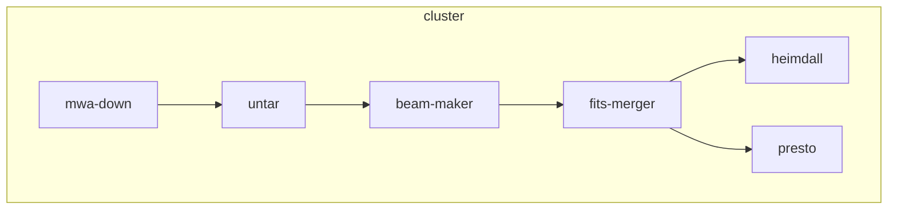

# MWA数据处理流水线

## 一、MWA流水线介绍

MWA流水线的模块结构示意图如下：



- mwa-down：实现mwa数据的广域网下载；
- untar：将原始产品数据的tar文件解包为单秒dat文件；
- beam-make：按beam、指向，生成fits文件；
- fits-merger：按指向，将同指向的24个beam的fits文件合并；
- heimdall：用单脉冲方法搜索前述的合并fits文件
- presto：用周期脉冲方法搜索前述的合并fits文件
- 
## 二、MWA流水线的相关数据量分析

### 2.1 原始产品数据(DIR_DAT)
- 按时间戳（秒）打包的24通道数据（后缀名为tar），解包后文件后缀为.dat
- 按观测数据集的数据量统计
  - 单个观测的时间长度：4800秒
  - 通道数：24个，109~132
  - 每个文件：327680000字节，313MiB
  - 文件总数：4800*24=115,200 个
  - 总数据量：3.775*10^13 B = 3.6*10^7 MiB ≈ 34.33 TiB
- 按12000指向计，数据处理需读取数据总量为：12000 * 34.33TiB ≈ 402.3PiB

### 2.2 定标数据(DIR_CAL)
- 按每个观测数据集来组织，还包含运行相关的元数据等
- 按观测数据集的数据量
  - 100MB以内

### 2.3 单指向、单通道的fits文件(DIR_1CH)
- 合并时间序列的原始数据，通过make-beam生成的数据
- 按观测数据集的单指向数据
  - 单指向、单通道200秒fits文件大小：256440960 B ≈ 244.56 MiB
  - 单指向单通道fits文件数量：24*4800/200=576个
  - 总数据量：244.56 MiB * 576 ≈ 137.57 GiB，约为原始数据的0.4%
- 按12000指向计，则总数据量为：12000 * 137.57 GiB ≈ 1.57PB

### 2.4 单指向24通道fits文件(DIR_24CH)
- 将单指向、单通道的fits文件合并为24通道的数据
- 按观测数据集的单指向数据
  - 单指向24通道200秒fits文件大小：6153860160 B ≈ 5.73 GiB
  - 单指向24通道fits文件数量：4800/200=24个
  - 总数据量：5.73 GiB * 24 ≈ 137.55 GiB
- 按12000指向计，则总数据量为：12000 * 137.55 GiB ≈ 1.57PB
  
### 2.5 单脉冲搜索文件

#### filterbank文件

#### cand文件

#### gold文件

#### png文件

### 2.6 周期脉冲搜索文件

#### ？

#### ？

## 三、原型测试

### 3.1 测试环境
- DCU计算节点
  - 4 DCU/节点
  - 128GB内存
  - 100GB本地可用的SSD

- 本地SSD加载原始观测产品数据、定标数据，并写入到本地SSD

### make-beam的初步测试结果
- 单次处理指向数：建议在[20..80]区间，从计算过程与计算节点数量一致的角度看，可以取24的倍数（24、48、72、...）；如果节点数为24的约数（12、8、6、4、3、2、1），可以取与节点数相同。
- 数据处理长度：2分钟到5分钟（上限还需要确认）
- 12000指向的单个观测数据集，处理时间预计为1600 DCU时

## 四、MWA流水线设计

### 4.1 设计思考
- MWA流水线


其主要模块的输入、输出数据量如下表：

|  模块名 | 输入数据量  | 输出数据量 |
|  ----  | ----  | ---- |
| untar     | 34.3TiB | 34.3TiB |
| beam-maker | 400 PiB | 1.57 PiB | 
| fits-merger | 1.57 PiB | 1.57 PiB | 

可以看出，beam-maker模块的读写数据规模极大，如何优化beam-maker模块是首要问题。

主要优化方法包括：
- 减少网络存储访问；
- 增加本地磁盘、本地内存缓存使用。

主要优化手段包括：
- 原始产品数据预处理（repack）
- 流水线模块优化设计，尽可能访问高性能存储（内存盘、内存缓存、本地SSD磁盘、本地磁盘、网络存储）

### 4.2 repack设计

  - 原始tar文件布局
  


每个tar文件中包含24通道的1秒数据。因后续的波束生成算法需按通道组织数据，直接用原始产品数据做数据处理，需要拷贝大量冗余的数据，因而，需要在数据处理前对产品数据的打包tar文件做预处理，对tar文件做布局调整，并做压缩处理。

  - 改进tar文件布局
  


改进后的tar布局，将打包维度调整为按时间维度，长度为30秒，并将内部的原始数据用高效的zstd算法做压缩处理（压缩率可达原始数据的近70%）。如果单次处理的时间长度超过30秒，则可以按30秒的倍数。

### 4.3 beam-maker 与 fits-merger

按前面分析，输入数据量最大的模块为beam-maker，按12000指向的数据处理，单观测数据集的输入数据超过400PB。如果完全基于网络存储，将会带来极大的存储性能瓶颈。为此设计利用本地磁盘、本地SSD、本地内存缓存等方式，提高计算效率。

考虑到本地存储、本地内存的容量不同可能支持24通道的数据存储，目前的设计方案，将单个测试时间长度的24通道数据分别放在24个计算节点上，比如：

以120秒数据，单次处理48指向，则：
- 120秒数据的单通道数据量：313MiB * 120 ≈ 36.7GiB
- beam-maker产生的单通道fits文件，没文件的数据量为原始数据的0.4%，其数据量为0.15 GiB，48指向合计7.2GiB
- fits-merger生成合并后的fits文件，数据量也可以按7.2GiB计
- 临时空间也按7.2GiB计
- 单节点的总数据量：36.7 + 7.2 * 3 = 58.3 GiB

针对同一组原始数据，可以按48个指向为1组，对12000指向进行循环处理。

### 4.4 流水线示意图

按以上思考，设计了以下的流水线结构：

```mermaid

flowchart TB
  mwa-down --> untar
  untar --> repack
  repack --> ftp-push
  ftp-push --> ftp-pull
  ftp-pull --> copy-untar
  repack --> rsync-pull
  rsync-pull --> copy-untar
  copy-untar --> beam-maker
  beam-maker --> fits-rsync
  fits-rsync --> fits-merger
  fits-merger --> heimdall
  fits-merger --> presto
  subgraph cluster2
    ftp-pull
    rsync-pull
    copy-untar
    beam-maker
    fits-rsync
    fits-merger
    heimdall
    presto
  end
  subgraph cluster1
    mwa-down
    untar
    repack
    ftp-push
  end
  
  ```

主要特点包括：
- 分布式集群计算
  - 预处理集群：原始产品数据中打包文件的布局调整；
  - DCU计算集群：beam-maker、fits-merger，以及单脉冲、周期脉冲的搜索

- I/O优化
  - 打包文件布局调整，减少冗余的文件加载
  - 以scalebox支持内存缓存、本地SSD的文件加载，实现模块间存储共享，极大提升I/O能力
