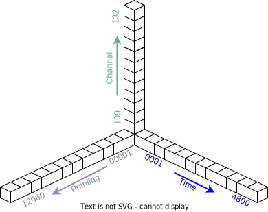

# MWA数据处理流水线

## 一、MWA流水线介绍

MWA流水线的模块结构示意图如下：

- mwa-down：通过广域网从澳大利亚下载mwa科学数据；
- unpack：mwa科学数据是按时间戳打包的tar文件，需解包为按channel、秒为单位的dat文件；
- beam-maker：按channel、指向，生成指定时间范围内单指向、单channel的？？数据（fits格式）；
- fits-merger：将同一指向的24个channel的？？数据合并；
- presto-search：用presto对前述24个channel的fits文件做消色散、脉冲搜索。

## 二、MWA流水线的主要数据及数据量统计

MWA流水线涉及的主要数据包括：
1. 定标数据
2. 原始产品数据（*.dat）
3. 单指向、单通道的？？数据（fits格式）
4. 单指向24通道？？数据（fits格式）
5. 最终搜索结果候选体数据：通过presto消色散、搜索得到的候选体文件

### 2.1 定标数据
- 按每个观测集来组织，还包含运行相关元数据等
- 数据规模相对固定，每个观测集的数据量：约72MiB

### 2.2 原始产品数据（DIR_DAT）
- 按时间戳（秒）打包的24通道数据（后缀名为tar），解包后文件后缀为.dat
- 按观测集的数据量统计
  - 单次观测的时间长度：4800秒
  - 通道数：24个，109~132
  - 每个文件字节数：327680000，313MiB
  - 文件总数：4800*24=115,200 个
  - 总数据量：3.775*10^13 Bytes = 3.6*10^7 MiB ≈ 34.33 TiB

### 2.3 单指向中间结果（DIR_1CH，单通道/fits格式）
- 合并时间序列的原始数据dat文件，通过make-beam生成单通道数据的fits文件
- 按观测集的单指向数据
  - 单指向、单通道30秒fits文件大小：38479680 B ≈ 36.70 MiB (1.223 MiB/秒)
  - 单指向单通道fits文件数量：24*4800/30=3840个
  - 总数据量：36.70 MiB * 3840 ≈ 137.61 GiB，约为原始数据的0.39%

### 2.4 单指向中间结果（DIR_24CH，24通道/fits格式）
- 将单指向、单通道的fits文件合并为24通道的fits文件，总数据量跟单通道数据规模比较接近。
- 按观测集的单指向数据
  - 总数据量：137.00 GiB
  
### 2.5 presto搜索结果（DIR_PIC）

- 单指向120秒数据处理结果约80MB，折合4800秒，数据量为3.21GB

### 2.6 总结
MWA数据处理过程中，需按1万多个指向进行处理，其读取数据量达原始数据的万倍以上，达到数百PB规模，其I/O优化是数据处理流水线设计的关键。此外流水线处理涉及到时间Time、通道channel、指向Pointing、色散DM等多维度交叉，如何优化模块设计、运行参数、处理顺序，减少中间文件占用，是数据处理流水线优化的另一个重点。

- MWA数据处理总量统计表（总指向数为12960）

|           | 单通道单秒  | 单指向读写量 | 全指向读写量 |
|-----------| --------  |  --------  |----------  |
| DIR_DAT   | 313 MiB   | 34.33 TiB  | 434.5PiB   |
| DIR_1CH   | 1.223 MiB | 137.61 GiB | 1.70 PiB   |
| DIR_24CH  |           | 137.00 GiB | 1.69 PiB   |
| DIR_PIC   |           | 3.21 GiB   | 40.63 TiB  |

## 三、MWA流水线特性研究及设计思考

从MWA流水线读写统计表可以看出，其I/O总量极大，优化I/O是流水线优化的首要问题。

对MWA数据处理过程进行分析，涉及到时间、通道、指向三个维度。其中：
1. 时间维度：每次观测数据为4800秒
2. 通道维度：从109到132，共24个channel
3. 指向维度：通过指向文件指定，当前值为12960个
  

图 3.1 MWA数据处理3个维度示意图

MWA处理步骤包括：
1. 时间维度变换处理：将给定时间区间的原始数据（*.dat），指定指向，按通道维度独立计算，生成给定时间区间内、单指向、单channel的结果文件，以fits格式存储；
2. 通道维度数据合并：将前一步骤中的同一指向、单通道的fits文件，按24个通道合并，形成同一指向、给定时间区间的结果文件，也以fits格式存储；
3. 按指向维度的数据处理：将前一步骤中同一指向的所有时间区间fits文件，放到统一目录中，形成统一指向的中间数据。将该数据输入到presto算法中，做消色散处理、候选体搜索，得到最终的脉冲星搜索结果。

若严格按以上步骤，依次在时间维度、channel维度、指向维度上进行数据处理。但这样的处理模式则带来I/O量急剧增加，不利于发挥并行数据处理的效率。

一种可能的方法是：一次数据读写可对多指向数据做批量量处理，这样在一定程度上可有效减少I/O总量，但带来的问题是对中间存储需求的增加。若无有效设计，不能有效利用并行计算能力做数据处理，还会因中间存储的大量增加，进一步加剧I/O瓶颈。

即便采用多指向批处理，其I/O总量依然远远超出现有各类计算设施的I/O能力。现有的并行计算框架（MPI等）、大数据框架（Hadoop/Spark等），都是基于共享存储实现，高I/O计算程序会导致整个计算集群出现严重的I/O瓶颈，影响对系统中其他并行执行程序的正常运行。

接下来的章节，研究MWA流水线特性，探索减少I/O总量的方法，研究MWA流水线中数据处理的局部性特征（data locality），结合不同层级存储硬件的读写带宽、访问延时的特性，设计出优化的MWA流水线。

优化后的MWA流水线，可通过容器化的Scalebox框架做计算处理，Scalebox支持的算法模块容器化，以本地计算模式实现高效的分级存储，并可在已有HPC硬件上运行，通过减少对共享存储访问，减低对HPC环境的影响。

#### 3.1 原始数据布局调整

对原始数据做预处理，便于后续按时间维、通道维、指向维的数据处理。
打包文件布局调整，避免冗余文件的加载，减少文件数量及I/O开销

图 3.2 原始tar文件布局示意图

出于数据管理、高性能网络传输的实际需求，将较小的数据文件打包为大文件，有效减少I/O数量，因而提升效率。
原始产品数据中将同1秒的24通道数据以tar格式打包，便于管理。
但在后续波束生成算法需按通道计算，直接用原始产品数据，需拷贝大量冗余数据，并且该操作需大量重复。因而，在正式数据处理前对产品数据tar文件做布局调整，按channel重新打包并做压缩处理。

图 3.3 改进tar文件布局示意图

改进后的tar布局，将打包维度调整为按时间维度，每个打包长度为30秒，并将内部的原始数据用高效的zstd算法做压缩处理（压缩率可达原始数据的70%）。后续计算过程中，单次处理时长设计为30秒的倍数。

### 3.2 按通道（Channel）做时间维、指向维的处理过程（make-beam）分析

考虑到本地存储、本地内存的容量难以支持24通道的数据存储，在分布式方案中，考虑将24通道数据分布于24个（组）计算节点上，指向make-beam操作。每个（组）节点对应一个通道的数据处理，考虑到减少中间存储占用，可采取如下图的顺序做波束合成。

图 3.4 时间-指向维度数据处理示意图

通过增加传输次数，使得尽早生成后续单指向全时间序列的数据，进而合成24-channel的fits数据，供presto做分析。

尽管增加了数据传输次数，但充分利用流水线并行特点，并不显著增加整个计算时间。

#### 3.3 分级存储体系分析

计算过程中，数据访问链路涉及到多种分级存储部件，各自有不同的特征。

图3.5 存储部件示意图

表3.1 存储相关硬件部件的读写带宽、访问延时的典型数值范围

|  部件名称 | 读写带宽  | 访问延时 |
|  ----  | ----  | ---- |
| CPU Cache | 100GB/s | 1ns |
| GPU Memory | 100~300GB/s | 5~10ns |
| Main Memory | 10GB/s | 10ns |
| Infiniband | 5~20GB/s | 5us |
| IB Backplane | 50~400GB/s | 1us |
| EtherNet | 1~10GB/s | 50us |
| Eth Backplane | 30~300GB/s | 1us |
| NVMe SSD | 4GB/s | 100us |
| HDD | 200MB/s | 10ms |

其中Ethernet、Infiniband部件为存储相关的网络设备，是整个计算环境的共享单元。针对HPC系统，其聚合带宽通常在20GB/s~300GB/s.

在计算过程中，需要从整体上优化存储的使用。从高性能的角度看，整个计算系统需具有较高的读写带宽、较小的访问延时。

计算系统的数据存储看，可以有定义以下的计算模式：
- 共享存储：通过计算环境中的高性能并行存储系统
- 共享内存：计算框架提供共享内存的统一访问
- 本地磁盘：用本地SSD、HDD存放计算过程的原始数据、中间结果

|         | 共享存储 | 共享内存  | 本地磁盘 |
|  ----  | ----  | ---- | ---- |
| 读写带宽 | ≤ 100GB/s  共享存储瓶颈 | ≤ 300GB/s  网络瓶颈  | N * 4GB/s |
| 访问延时 | ≥ 2ms  网络延时+存储延时 | ≥ 1ms 网络延时 | ≥ 100us  本地SSD访问延时 |
| 并行框架 | MPI、Hadoop | Spark、Dask | Scalebox |

按前面分析，读写数据量最大的模块为beam-maker。按12960指向计，单观测集的读写数据超过430PiB。基于本地磁盘（本地磁盘、本地SSD）构建可支持计算过程的分级存储（内存缓存+本地磁盘）系统，不同节点之间不存在相互干扰，实现真正的横向扩展，提高数据加载效率。

### 3.4 原始数据、中间结果的压缩

数据压缩处理可以有效减少加载的数据总量。在Scalebox并行框架支持下，将数据传输、数据压缩/解压与计算过程并行执行，除了消耗少量CPU资源外，在并不对计算时间造成实质性影响。

#### 原始数据压缩

在3.1节中，对原始数据布局调整的同时，用无损压缩算法对数据做高效压缩处理。

zstd是一种高效的压缩方法；合理利用，则可以在增加CPU的同时，较为显著地降低数据规模。原始数据（tar/dat）经过自适应压缩处理后，压缩比达到0.68~0.70。

单观测集数据压缩前数据量为34.3TiB，采用zstd压缩后，数据量约23.7TiB。

#### 中间结果压缩

针对中间结果，在时间维度上做1:4的重采样，将数据量减少到之前的1/4。采样后数据在用zstd做无损压缩，进一步减少数据量。

经测试，采用zstd压缩中间结果fits文件，其压缩比约为0.82。

中间结果的最终压缩比达到原始数据的0.205。

针对单观测集、单指向的中间结果数据，单通道/24通道压缩后数据量大约都是28GiB。

## 四、流水线设计与实现

MWA流水线涉及的主要数据总量统计表

|  数据分类 | 环境变量 | 单指向 | 全指向 |
|-----------|--------|--------|----------|
| 原始产品数据 | DIR_TAR   |  34.33 TiB   |  |
| 布局调整、压缩后数据 | DIR_REPACK   | 23.7 TiB   |  |
| 原始数据 | DIR_DAT   |  34.33 TiB   | 434.5PiB |
| 单通道中间结果| DIR_1CH   |  137.61 GiB | 1.70 PiB |
| 单通道重采样结果| DIR_1CHX  |  28.24 GiB  | 357.41 TiB |
| 24通道中间结果 | DIR_24CH  |  28.31 GiB  | 358.29 TiB |
| 脉冲搜索结果 | DIR_PIC  |  880 MiB   | 10.88 TiB |

- 分布式集群计算
  - 预处理集群：原始产品数据中打包文件的存储布局调整；
  - DCU计算集群：主要计算过程，包括beam-maker、fits-merger，以及利用presto做单脉冲、周期脉冲的搜索等。

基于第三章的设计思考，设计了以下的流水线结构：

### 4.1 预处理流水线

预处理结果通过ftp工具传输到大规模共享存储，以便尤其直接使用。

### 4.2 波束合成流水线

若不涉及到ftp数据，可以用单集群，dir-list模块可以放在计算集群。
- cluster-tar-pull: 从外部集群拷贝数据到本集群共享存储；
- local-tar-pull: 从本集群存储拷贝数据到计算节点；
- unpack：从计算集群共享存储，拷贝数据到节点存储；
- local-tar-pull、unpack、down-sampler、fits-redist、fits-merger都需指定为HOST-BOUND
- beam-maker设定为HOST-BOUND或GROUP-BOUND

- 以scalebox支持本地内存缓存、本地SSD的文件加载，实现模块间存储共享，极大提升I/O能力

### 4.3 脉冲搜索流水线

## 五、原型测试

mwa流水线中，make_beam模块涉及数据量巨大，通过设计原型测试，了解其定量运行数据，以便流水线优化。

### 5.1 测试环境
- DCU计算节点
  - 4 DCU/节点
  - 128GB内存
  - 120GB本地可用的SSD

- 本地SSD加载原始观测产品数据、定标数据，并写入到本地SSD

### 5.2 make-beam的初步测试结果
- 单次处理指向数：从计算过程与计算节点数量一致的角度看，可以取24的倍数（24、48、72、...）；如果节点数为24的约数（12、8、6、4、3、2、1），可以取与节点数相同。
- 数据处理长度：2分钟到5分钟（上限还需考虑计算过程的GPU资源消耗、本地SSD容量、内存容量后，再确认）
- 12960指向的单个观测数据集，处理时间预计为1600 DCU时

针对同一组原始数据，可以按24个指向为1组，对12960指向循环处理。

关于参数选择的实验，参见：[beam-maker](dockerfiles/beam-maker/test/README.md)

### 5.3 MWA流水线测试结果

- 测试环境：2节点，4DCU卡

|  模块名 | 传统计算  | 本地计算 | 加速比 |
|  ----  | ----| ----| ---- |
| 波束合成 beam-maker  | 
 9910.76 
| 
 744.11 
| 
 13.32 
|
| 下采样 down-sampler  | 
 64.38 
| 
 3.67
| 
 17.54 
|
| fits合并 fits-merger | 
 542.12 
| 
 38.58
| 
 14.05 
|
