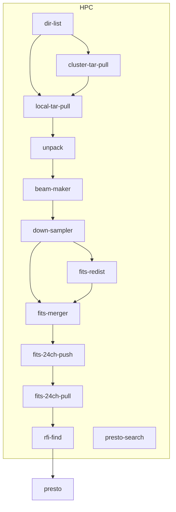

# mwa流水线详细设计

## 一、流水线总体结构

## 二、模块功能设计表

| 模块名                                                                  | 英文标识             | 基础镜像                 | 代码 | 模块说明                      | 输入消息格式（示例）                                                                                                                                  | 输出结果（文件/目录）                                                                                         | task分发排序             | 流控参数                 | 主要环境变量 | timeout参数 |
|----------------------------------------------------------------------|------------------|----------------------|----|---------------------------|---------------------------------------------------------------------------------------------------------------------------------------------|-----------------------------------------------------------------------------------------------------|----------------------|----------------------|--------|-----------|
| 数据集文件列表                                                              | dir-list         | scalebox/dir-list    | 无  | 遍历再打包后的归档tar目录，生成文件列表     | "/raid0/scalebox/mydata/mwa/tar~1257010784 (local)                                                                                          |
| user@ip_addr:port/raid0/scalebox/mydata/mwa/tar~1257010784（cluster）" |                  |                      |    |                           |                                                                                                                                             |
| 远端文件拷贝                                                               | cluster-tar-pull | scalebox/rsync-copy  | 无  | 将tar文件从集群外拉取到集群内主存储，实现分级  | user@ip_addr:port/raid0/tmp/mwa/tar1257010784~1257010784/1257010786_1257010815_ch111.dat.zst.tar~/data/mwa/tar                              |                                                                                                     | 按图3.4动态设置，用代码设置      |                      |        |           |
| 本地文件拷贝                                                               | local-tar-pull   | scalebox/rsync-copy  | 无  | 将tar文件从集群外(跳板)/集群内拉取到计算节点 | root@10.200.1.100:22/raid0/scalebox/mydata/mwa/tar~1257010784/1257010816_1257010845_ch118.dat.zst.tar~/dev/shm/scalebox/mydata/mwa/tar      |                                                                                                     | 按图3.4动态设置，用代码设置      | tar目录最大容量（最多2组）      |        |           |
| dat解压解包                                                              | unpack           | scalebox/agent       | 有  | 将打包文件解包为dat文件             | 1257010784/1257010786_1257010815_ch115.dat.zst.tar~1257010786_1257010845（文件路径~目标目录）                                                         | /tmp/scalebox/mydata/mwa/dat/1257010784/ch123/1257010786_1257010845/1257010784_1257010786_ch123.dat |                      | 设置本节点内存缓存中dat目录最多字节数 |        |           |
| 波束生成                                                                 | beam-maker       | app-mwa/mwa-vcstools | 有  | 处理单波束、给定时段、指向范围的数据        | 1257010784/1257010786_1257010845/126/00001_00024                                                                                            | /dev/shm/scalebox/mydata/mwa/1ch/1257010784/1257010786_1257010845/00001/109.fits                    | 以regex提取，按通道、时间、指向排序 | DIR_1CHX最大容量         |        |           |
| 下采样                                                                  | down-sampler     | app-mwa/down-sampler | 无  | 对fits文件做1:4的下采样，并压缩       | 1257010784/p00023/t1257010786_1257010845/ch121.fits                                                                                         | /dev/shm/scalebox/mydata/mwa/1chx/1257010784/p00001/t1257010786_1257010845/ch109.fits.zst           |                      |                      |        |           |
| 按指向fits分发                                                            | fits-redist      | scalebox/rsync-copy  | 无  | 从按通道的数据推送到按指向的计算节点        | /dev/shm/scalebox/mydata/mwa/1chx~1257010784/p00020/t1257010786_1257010845/ch123.fits.zst~root@10.11.16.75/dev/shm/scalebox/mydata/mwa/1chx | /dev/shm/scalebox/mydata/mwa/1chx/1257010784/p00001/t1257010786_1257010845/ch109.fits.zst           |                      |                      |        |           |
| fits合并                                                               | fits-merger      | app-mwa/mwa-vcstools | 有  | 将同指向、同时段的24个单通道合并为1个24通道  | 1257010784/p00018/t1257010786_1257010845                                                                                                    | /dev/shm/scalebox/mydata/mwa/24ch/1257010784/p00001/t1257010786_1257010845.fits                     |                      |                      |        |           |
| fits推送                                                               | fits-24ch-push   | scalebox/rsync-copy  | 无  | 将24通道数据推送到共享存储或presto搜索节点 |                                                                                                                                             |                                                                                                     |                      |                      |        |           |
|                                                                      | fits-24ch-pull   | scalebox/rsync-copy  | 无  | 共享存储拉取24通道数据到presto搜索节点   |                                                                                                                                             |                                                                                                     |                      |                      |        |           |
| rfi-find                                                             | rfi-find         | app-mwa/presto       | 有  |                           | 1257010784/p00021/t1257010786_1257010845                                                                                                    |                                                                                                     |                      |                      |        |           |
| presto-search                                                        | presto-search    | app-mwa/presto       | 有  |                           | 1257010784/p00021/t1257010786_1257010845                                                                                                    | /dev/shm/scalebox/mydata/mwa/png/1257010784/p00001/t1257010786_1257010845                           |

## 三、message-router设计

| from_job                                                                                         | 消息格式（示例）                                                                                   | 处理步骤                                             |
|--------------------------------------------------------------------------------------------------|--------------------------------------------------------------------------------------------|--------------------------------------------------|
| （空）                                                                                              | "                                                                                          | /raid0/scalebox/mydata/mwa/tar~1257010784（local） |
|                                                                                                  | user@ip_addr:port/raid0/tmp/mwa/tar~1257010784（remote）"                                    | "基于数据集的元数据，创建初始信号量组                              |
|  - dat-ready                                                                                     |
|  - dat-used                                                                                      |
|  - fits-24ch-ready                                                                               |
|  - fits-time-series-ready                                                                        |
| 发送消息给dir-list"                                                                                   |
| dir-list                                                                                         | "/raid0/scalebox/mydata/mwa/tar~1257010784/1257010906_1257010935_ch113.dat.zst.tar(local)  |
| user@ip_addr:port/raid0/tmp/mwa/tar~1257010784/1257012766_1257012795_ch123.dat.zst.tar(cluster)" | "local模式，则给local-copy发送消息                                                                  |
|  - 若为本地地址，则从本地rsync；                                                                             |
|  - 若为远端地址，则转转为基于jump-server的rsync；                                                               |
| remote模式，则给cluster-copy发送数据传输消息；"                                                                |
| cluster-tar-pull                                                                                 | 1257010784/1257010816_1257010845_ch113.dat.zst.tar                                         | 直接转发消息体至local-copy                               |
| local-tar-pull                                                                                   | 1257010784/1257010816_1257010845_ch113.dat.zst.tar                                         | 直接转发消息体至unpack，指定to_ip头                          |
| unpack                                                                                           | 1257010784_1257010905_ch132.dat                                                            | 信号量dat-ready减1；若为0，则发多个指向范围的消息，启动启动beam-maker    |
| beam-maker                                                                                       | 1257010784/p00001/t1257010786_1257010845/ch117.fits                                        | "信号量dat-used减1，若为0，删除本地dat文件组                    |
| 给down-sampler发启动消息"                                                                              |
| down-sampler                                                                                     | 1257010784/p00022/t1257010786_1257010845/ch109.fits.zst                                    | "若对应指向不在本机，则发送消息给fits-dist;                      |
| 信号量fits-24ch-ready减1，若为0则给fits-merger发启动消息"                                                      |
| fits-redist                                                                                      | 1257010784/p00020/t1257010786_1257010845/ch113.fits.zst                                    | 信号量fits-24ch-ready减1，若为0则给fits-merger发启动消息       |
| fits-merger                                                                                      | 1257010784/p00002/t1257010786_1257010845                                                   | 给presto-search发启动消息；                             |
| fits-24ch-push                                                                                   |                                                                                            |                                                  |
| fits-24ch-pull                                                                                   |                                                                                            |                                                  |
| rfi-find                                                                                         |                                                                                            |                                                  |
| presto-search                                                                                    |

## 四、信号量设计

信号量是scalebox中用于任务间同步的重要概念，在复杂应用逻辑场景下，集中管理全系统的运行状态标识，使得计算模块无状态。信号量通常仅在message-router中被调用，以避免并发导致的问题。

| 信号量名                   | 英文标识（示例）                                                 | 信号量说明                                         | 信号量初值                                            | 信号量操作                            | 信号量触发              |
|------------------------|----------------------------------------------------------|-----------------------------------------------|--------------------------------------------------|----------------------------------|--------------------|
| dat-ready              | dat-ready:1257010784/t1257010786_1257010845/ch119        | 标识beam-maker模块执行所需dat文件已就绪                    | beam-maker单次处理的数据长度，通常为30倍数                      | 在unpack后，对每个dat文件，对应信号量减1。       | 按指向给beam-maker发送消息 |
| dat-used               | dat-used:1257010784/t1257010846_1257010905/ch111         | 标识本轮、多次beam-maker已完成，以便从本地存储移除对应时段数据，保障后续流式处理 | beam-maker本轮多次处理的pointing数量和，通常为24倍数。            | 在beam-maker后，对每个pointing，对应信号量减1 | 删除对应时间区间的所有dat文件   |
| fits-24ch-ready        | fits-24ch-ready:1257010784/p00008/t1257010786_1257010845 | 标识单指向、选定时段、待合并的24个单通道fits文件已就绪，并分发至对应节点       | 24（通道总数）                                         | 单通道数据就绪（toFitsMerger），对应信号量减1    | 给fits-merger发单条消息  |
| fits-time-series-ready | fits-time-series-ready:1257010784/p00008                 | 标识单指向、24通道、全时间序列的fits文件（完整的channel、time平面）已就绪 | 观测集的time-series分段数（若单次处理时长为150秒，则初值为4800/150=32） | 在fits-push后，对应信号量减1              | 给fits-pull发单条消息    |

