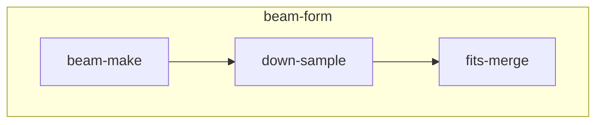

# app-base

基于共享存储的波束合成




## 一、数据准备

### p419集群

- 从管理节点本地存储到共享存储

```sh
cd pipelines/beam-form/modules/pull-unpack/test


START_MESSAGE=1255803168 \
scalebox app create -e p419.env

```

## 流水线测试

### p419
```sh
START_MESSAGE=1255803168/p00961_01440 \
OUTPUT_ROOT_24CH=/work1/cstu0036/mydata \
scalebox app create -e p419.env

```


```sh
START_MESSAGE=1257617424/p00001_00585 \
OUTPUT_ROOT_24CH=/work1/cstu0036/mydata \
scalebox app create -e p419.env

```

### dcu

```sh
START_MESSAGE=1257617424/p00001_00096/t1257617426_1257617505 \
TIME_STEP=80 \
scalebox app create
```


## 测试结果

以独享方式，访问HPC存储。该存储系统磁盘数量600+.

若计算节点多于60个，出错概率明显增加。表现为slot、task的状态均为'RUNNING'，但该节点实际已退出运行队列，不可再访问，slurm中状态标识为```down*```或```drain*```。可能原因：超出了HPC调度系统slurm所认定的计算节点繁忙程度的范围，被判断为节点状态异常，在slurm的应用log中甚至并未纪录下job异常退出的信息。退出节点的DCU卡需要重启后才可恢复正常。

出现以上情况后，目前需人工介入task、slot的状态管理，将task状态码从-3调整为-1，使得计算过程仍然可以正常结束。

若计算节点数量达到120个，beam-make计算过程中出现超出1/4的计算task（11470/8640）超时出错(超时时间设定为60分钟)。说明计算过程中I/O访问极度恶化，计算无法正常完成。


