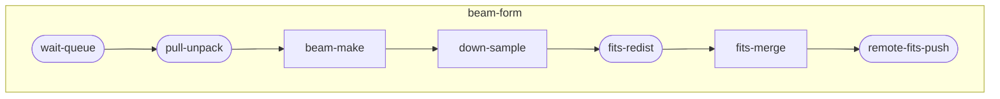

# app

```mermaid
flowchart TD
  subgraph beam-form
    A([wait-queue]) --> B([pull-unpack])
    B --> C[beam-make]
    C --> D[down-sample]
    D --> E([fits-redist])
    E --> F[fits-merge]
    F --> G([remote-fits-push])
  end
```
