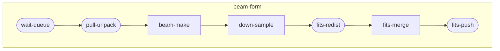

# app



## 一、数据准备

### p419集群

在scalebox/dockerfiles/files/app-dir-copy目录下

#### 预拷贝文件到共享存储
- 全数据集拷贝

```sh
TARGET_URL=cstu0036@60.245.128.14:65010/work2/cstu0036/tmp \
SOURCE_URL=/data2/mydata/mwa/tar DIR_NAME=1255803168 \
scalebox app create
```
### dcu集群

## 二、波束合成计算

### p419集群

- 1440指向(全并行处理)
```sh
  START_MESSAGE=1255803168/p05161_06600 \
  PRESTO_APP_ID=102 \
  POINTING_FIRST=yes \
  PRESTO_NODES=a-.+ \
  scalebox app create -e p419.env
```

- 单次160秒数据处理

START_MESSAGE=1255803168/p06841_07560/t1255803170_1255807967

```sh
  START_MESSAGE=1255803168/p07561_08280/t1255803170_1255807967 \
  PRESTO_APP_ID=102 \
  NODES=d-0[01].+ \
  PRESTO_NODES= \
  TIME_STEP=160 \
  PULL_UNPACK_LIMIT_GB=90 \
  BEAM_MAKE_FREE_GB='{~n*5+11~}' \
  TARGET_24CH_ROOT=/work1/cstu0036/mydata \
  scalebox app create -e p419.env
```

- 单次120秒数据处理

START_MESSAGE=1255803168/p06841_07560/t1255803170_1255807967

```sh
  START_MESSAGE=1255803168/p08641_09240/t1255803170_1255807967 \
  PRESTO_APP_ID=102 \
  NODES=d-0[01].+ \
  PRESTO_NODES= \
  TIME_STEP=120 \
  PULL_UNPACK_LIMIT_GB=65 \
  BEAM_MAKE_FREE_GB='{~n*4+9~}' \
  TARGET_24CH_ROOT=/work1/cstu0036/mydata \
  scalebox app create -e p419.env
```

- 240指向测试
```sh
  START_MESSAGE=1267459328/p00001_00240 \
  PRESTO_APP_ID=102 \
  TIME_STEP=160 \
  PULL_UNPACK_LIMIT_GB=/tmp/scalebox/mydata/mwa/dat:90 \
  SOURCE_URL=astro@10.100.1.30:10022/data2/mydata \
  TARGET_24CH_ROOT=astro@10.100.1.30:10022/data1/mydata \
  NODES=d-00.+ \
  scalebox app create -e p419.env
```

- 生产测试，source_url通过p419-soruce.json来指定
```sh
  START_MESSAGE=1255803168/p04681_04920 \
  PRESTO_APP_ID=61 \
  scalebox app create -e p419.env
```


```sh
  START_MESSAGE=1257617424/p00001_00096/t1257617426_1257617585 \
  TIME_STEP=80 \
  NODES="n-000[0-9]|n-001[01]" \
  scalebox app create -e p419.env
```


### dcu集群

- source_url通过dcu-soruce.json来指定

```sh
  START_MESSAGE=1257617424/p00001_00096 \
  TIME_STEP=80 \
  TIME_END=1257617505 \
  NODES=n-0[023] \
  NUM_BEAM_MAKE=3 \
  TARGET_JUMP=root@10.200.1.100 \
  scalebox app create
```


```sh
  START_MESSAGE=1257617424/p00001_00096/t1257617426_1257617585 \
  TIME_STEP=80 \
  NODES=n-0[123] \
  scalebox app create
```

## 新增一个队列原始

```sh
docker exec server_redis_1 redis-cli -h localhost -p 6379 ZADD QUEUE_HOSTS 1.0 10.11.16.79:9876543210

docker exec server_redis_1 redis-cli -h localhost -p 6379 ZADD QUEUE_HOSTS 1.0 10.11.16.79:9876543211
```


## beam-make的slot容错

```sql
-- 优化后的SQL语句
UPDATE t_slot
SET status = 'READY'
WHERE id IN (
    SELECT t.slot
    FROM t_slot s
    JOIN (
        SELECT slot, event_type,
               ROW_NUMBER() OVER (PARTITION BY slot ORDER BY id DESC) AS rn
        FROM t_slot_status
        WHERE event_type IN ('slot_started', 'slot_completed')
    ) t ON s.id = t.slot
    WHERE s.job = 440 AND s.status = 'ERROR' AND t.rn = 1 AND t.event_type = 'slot_completed'
);

-- postgresql优化版本（未测试）
UPDATE t_slot
SET status = 'READY'
FROM (
    SELECT slot
    FROM t_slot_status
    WHERE event_type IN ('slot_started', 'slot_completed')
    AND ROW_NUMBER() OVER (PARTITION BY slot ORDER BY id DESC) = 1
    AND event_type = 'slot_completed'
) t
WHERE t_slot.id = t.slot
  AND t_slot.job = 440
  AND t_slot.status = 'ERROR';

```

## 波束合成结果核对

### 文件按从大到小排列

```sh
find . -type f -exec ls -l {} + | sort -k 5 -nr
```

### 列出一级子目录下的文件数量

```sh
find . -maxdepth 2 -type f | cut -d'/' -f2 | sort | uniq -c | awk '{print $2 ": " $1}'
```
