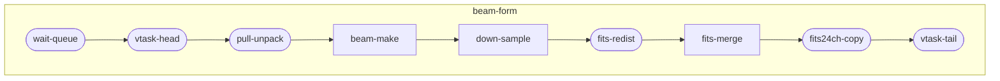

# app



## 一、数据拷贝

### p419集群

在scalebox/dockerfiles/files/app-dir-copy目录下

#### 预拷贝tar文件到HPC存储
- 全数据集拷贝

```sh
TARGET_URL=cstu0036@10.100.1.104:65010/work2/cstu0036/tmp \
SOURCE_URL=/data2/mydata/mwa/tar DIR_NAME=1255803168 \
scalebox app create
```

```sh
export SOURCE_URL=/data2/mydata/mwa/tar
export TARGET_URL=cstu0036@60.245.128.14:65010/work2/cstu0036/mydata/mwa/tar

scalebox app run --image-name=hub.cstcloud.cn/scalebox/file-copy:latest 1267459328/1267464090_1267464129_ch127.dat.tar.zst

cd $SOURCE_URL
find 1302106648 -type f|sort|scalebox app run --image-name=hub.cstcloud.cn/scalebox/file-copy:latest --slot-regex=h0:6

```


#### 结果文件拷贝
```sh

export SOURCE_URL=cstu0036@60.245.128.14:65010/work1/cstu0036/mydata/mwa/24ch
export TARGET_URL=/data1/mydata/mwa/24ch
ssh login1 'cd /work1/cstu0036/mydata/mwa/24ch && find 1265983624-250707 -type f' | sort | scalebox app run --image-name=hub.cstcloud.cn/scalebox/file-copy:latest --slot-regex=h0:6

```


### dcu集群


## 二、波束合成计算

### p419集群全并行

- 1440指向(全并行处理)
```sh
START_MESSAGE=1302106648/p02041_03480/t1302106649_1302111446 \
  PRESTO_APP_ID=175 \
  PRESTO_NODES=a.+ \
  PRELOAD_MODE=none \
  NODES=d.+ \
  RUN_MODE=full_parallel \
  TIME_STEP=200 \
  PULL_UNPACK_LIMIT_GB=120 \
  BEAM_MAKE_FREE_GB='{~n*7+14~}' \
  scalebox app create -e p419.env
```


### p419集群流式并行

#### preload
```sh
echo '1266680784/p01921_02880/t1266680787_1266681106' | \
PRELOAD_MODE=preload-only \

echo '1266680784/p_00960' | \
PRELOAD_MODE=yes \

```

#### 流水线运行

echo '1253991112/p01321_02280' | \

echo '1302282040/p00961_01920' | \


echo '1266680784/p00001_00048/t1266680787_1266681586' | \
TIME_STEP=80 \

```sh

echo '1266680784' | \
PRELOAD_MODE=yes \
NUM_GROUPS=1 \
NODES='^d.+' \
ORIGIN_ROOT=astro@10.100.1.30:10022/data2/mydata \
POINTING_FILE=pointings-260108.txt \
GROUP_NODES= \
PRESTO_APP_ID= \
PRESTO_NODES= \
scalebox app run -e p419.env

```


- 每组观测起始指向处理
```sh
START_MESSAGE=1253991112/p00001_00120/t1253994234_1253994833 \
  PRESTO_APP_ID= \
  PRESTO_NODES= \
  NODES='d00.+' \
  POINTING_FILE= \
  FIRST_BW_LIMIT=70m \
  BW_LIMIT=60m \
  TIME_STEP=120 \
  PULL_UNPACK_LIMIT_GB=65 \
  BEAM_MAKE_FREE_GB='{~n*4+9~}' \
  scalebox app create -e p419.env
```

- 单次200秒数据处理
```
  TIME_STEP=200 \
  PULL_UNPACK_LIMIT_GB=120 \
  BEAM_MAKE_FREE_GB='{~n*7+14~}' \
```

- 单次160秒数据处理
```
  TIME_STEP=160 \
  PULL_UNPACK_LIMIT_GB=90 \
  BEAM_MAKE_FREE_GB='{~n*5+11~}' \
```

- 单次120秒数据处理
```
  TIME_STEP=120 \
  PULL_UNPACK_LIMIT_GB=65 \
  BEAM_MAKE_FREE_GB='{~n*4+9~}' \
```


### dcu集群

- source_url通过dcu-soruce.json来指定

```sh
  START_MESSAGE=1302106648/p00001_00096/t1302106649_1302106888 \
  SOURCE_TAR_ROOT=scalebox@159.226.237.136:10022/raid0/tmp \
  TIME_STEP=80 \
  NODES=n-0[012] \
  NUM_BEAM_MAKE=2 \
  TARGET_JUMP=root@10.200.1.100 \
  scalebox app create
```

- singularity
```sh
  START_MESSAGE=1267459328/p00001_00096/t1267459330_1267459409 \
  TIME_STEP=80 \
  NODES=n-0[012] \
  NUM_BEAM_MAKE=2 \
  TARGET_JUMP=root@10.200.1.100 \
  scalebox app create -e dcu.env
```


```sh
  START_MESSAGE=1257617424/p00001_00096 \
  TIME_STEP=80 \
  NODES=n-0[023] \
  NUM_BEAM_MAKE=3 \
  TARGET_JUMP=root@10.200.1.100 \
  scalebox app create
```


```sh
  START_MESSAGE=1257617424/p00001_00096/t1257617426_1257617585 \
  TIME_STEP=80 \
  NODES=n-0[123] \
  scalebox app create
```

## 新增一个队列原始

```sh
docker exec server_redis_1 redis-cli -h localhost -p 6379 ZADD QUEUE_HOSTS 1.0 10.11.16.79:9876543210

docker exec server_redis_1 redis-cli -h localhost -p 6379 ZADD QUEUE_HOSTS 1.0 10.11.16.79:9876543211
```


## 单目录波束合成结果核对

- 文件按从大到小排列

```sh
find . -type f -exec ls -l {} + | sort -k 5 -nr
```

- 列出一级子目录下的文件数量

```sh
find . -maxdepth 2 -type f | cut -d'/' -f2 | sort | uniq -c | awk '{print $2 ": " $1}'
```


```sh
for i in {030..150}; do
cd /public/home/cstu0${i}/scalebox/mydata/mwa/24ch/1266680784;
find . -type f -exec ls -l {} + | sort -k 5 -nr;
done | sort
```


```sh
for i in {030..150}; do
  dir="/public/home/cstu0${i}/scalebox/mydata/mwa/24ch/1266680784"
  if [ -d "$dir" ]; then
    cd "$dir" || continue
    find . -maxdepth 2 -type f | cut -d'/' -f2 | sort | uniq -c | awk '{print $2 ": " $1}'
  fi
done | sort
```


## 重启server端daemon
```sh
LOCAL_ADDR=10.100.1.30 docker compose up -d --no-deps --force-recreate actuator
```


```sh

export TARGET_URL=/data1/mydata/mwa/24ch
export SOURCE_DIR=/public/home/cstu0038/scalebox/mydata/mwa/24ch
export SOURCE_URL=cstu0030@60.245.128.14:65010${SOURCE_DIR}


ssh login1 "cd $SOURCE_DIR; find 1302106648 -type f" | sort | scalebox app run --slot-regex='h0' --image-name=hub.cstcloud.cn/scalebox/file-copy

```