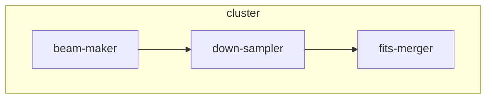
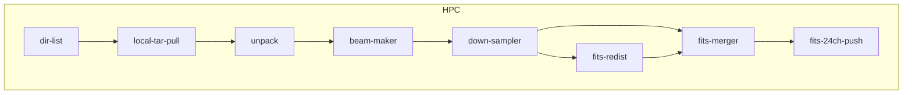

# 共享存储 vs 本地存储 测试

## 1. 实验环境

- 2节点DCU
  - 每节点4个DCU卡
  - 单路32核AMD CPU（16GB显存）
  - 128GB内存
  - 240GB SSD
- 自建gluaster共享存储

## 2. 实验方案

针对24通道30秒数据，做480指向的波束合成；

基于共享存储的方案，示意图如下：

其中
- beam-maker：dat转fits；
- down-sampler: 下采样
- fits-merger：单通道数据合并为24通道数据

基于本地存储的方案，示意图如下：

原始数据、最终结果数据都在另一个存储集群。

以下模块中，需设置支持本地计算
- local-tar-pull、unpack、down-sampler、fits-redist、fits-merger都需指定为HOST-BOUND
- beam-maker设定为HOST-BOUND或GROUP-BOUND

## 3. 实验结果

| Job Name       | Shared | Storage   |       |       | Local  | Storage  |       |       | SpeedUp |
| -------------- | ------ | --------- | ----- | ----- | ------ | -------- | ----- | ----- | ------- |
|                | AVG(s) | SUM(s)    | tasks | slots | AVG(s) | SUM(s)   | tasks | slots |         |
| -------------- | ------ | --------- | ----- | ----- | ------ | -------- | ----- | ----- | ------- |
| local-tar-pull |        |           |       |       | 117.46 | 2819.08  | 24    | 2     |         |
| unpack         |        |           |       |       | 18.05  | 433.24   | 24    | 2     |         |
| beam-maker     | 952.41 | 457156.08 | 480   | 12    | 105.22 | 50506.51 | 480   | 12    | 9.051   |
| down-sampler   | 9.17   | 105619.21 | 11520 | 2     | 0.74   | 8467.29  | 11520 | 2     | 12.474  |
| fits-redist    |        |           |       |       | 0.74   | 4289.09  | 5760  | 2     |         |
| fits-merger    | 103.08 | 45124.27  | 480   | 2     | 4.70   | 2254.09  | 480   | 2     | 21.950  |
| fits-24ch-push |        |           |       |       | 4.95   | 2374.42  | 480   | 2     |         |

